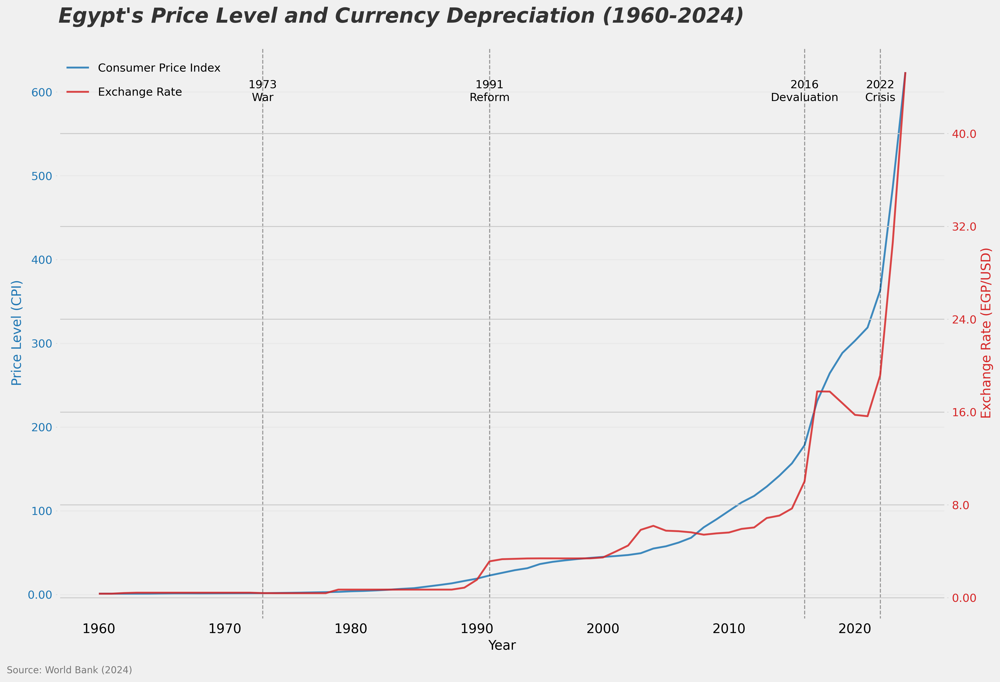

# Egypt Price Level and Currency Depreciation Analysis (1960-2024)



## 📊 Project Overview

This project analyzes** ****64 years of historical economic data** from Egypt, examining how consumer prices and currency value have changed from 1960 to 2024. Using data from the World Bank, we visualize the dramatic impact of inflation and currency depreciation on the Egyptian economy.

### Key Question

**What happened to prices and the Egyptian Pound over 64 years?**

**Answer:**

* 🔵** ****CPI increased 500 times** (from 1.21 to 623.83)
* 🔴** ****Egyptian Pound weakened 130 times** (from 0.35 to 45.30 EGP/USD)

---

## 🎯 Main Findings

### The Numbers

| Metric                      | 1960         | 2024          | Change               |
| --------------------------- | ------------ | ------------- | -------------------- |
| **CPI (Price Level)** | 1.21         | 623.83        | **500.3×** ↑ |
| **Exchange Rate**     | 0.35 EGP/USD | 45.30 EGP/USD | **129.4×** ↓ |

### What This Means

If you had** ****100 Egyptian Pounds** in 1960:

* **Worth in 1960:** $285 USD 💵
* **Same 100 EGP in 2024:** $2.20 USD 😱
* **Loss of value:** 99.2%

---

## 📂 Repository Structure

```
Price-Level-Histories/
├── README.md
├── requirements.txt
├── .gitignore
├── LICENSE
├── data/
│   ├── egypt_cpi.xls
│   └── egypt_exchange.xls
├── code/
│   └── egypt_chart_compact.py
├── output/
│   └── Egypt_Price_History_Linear.png
└── docs/
```

---

## 🚀 Quick Start

### Prerequisites

* Python 3.7 or higher
* pip (Python package manager)

### Installation

**Step 1: Clone the repository**

```bash
git clone https://github.com/yourusername/Price-Level-Histories.git
cd Price-Level-Histories
```

**Step 2: Install dependencies**

```bash
pip install -r requirements.txt
```

### Running the Analysis

```bash
python code/egypt_chart_compact.py
```

The chart will be saved to** **`output/Egypt_Price_History_Linear.png`

---

## 💾 Data Sources

* **Consumer Price Index (CPI)**
  * Indicator:** **`FP.CPI.TOTL`
  * Source: World Bank Open Data
  * URL: https://data.worldbank.org/indicator/FP.CPI.TOTL
* **Official Exchange Rate**
  * Indicator:** **`PA.NUS.FCRF`
  * Unit: EGP per USD
  * Source: World Bank Open Data
  * URL: https://data.worldbank.org/indicator/PA.NUS.FCRF

**Time Period:** 1960-2024

---

## 📚 Course Reference & Attribution

### QuantEcon Course

This project is based on** ****QuantEcon Lecture 4: Price Level Histories**

* **Course:** A First Course in Quantitative Economics with Python
* **Instructors:** Thomas J. Sargent, John Stachurski
* **Lecture URL:** https://intro.quantecon.org/inflation_history.html
* **Course Repository:** https://github.com/QuantEcon/lecture-python-intro

### Acknowledgments

* **Data:** World Bank Open Data
* **Course Platform:** QuantEcon.org
* **Visualization Style:** FiveThirtyEight matplotlib style
* **Educational Context:** QuantEcon Quantitative Economics Course

### References

* Sargent, T. J., & Velde, F. R. (2002).** ** *The big problem of small change* . Princeton University Press.
* Sargent, T. J. (2013).** ***Rational expectations and inflation* (3rd ed.). Princeton University Press.

---

## 📊 Chart Features

### What You See

* **Blue Line (Left Axis):** Consumer Price Index (CPI)
* **Red Line (Right Axis):** Exchange Rate (EGP/USD)
* **Dashed Vertical Lines:** Major economic events (1973 War, 1991 Reform, 2016 Devaluation, 2022 Crisis)
* **Grid Lines:** Help read values accurately

### Scale Type

* **Linear Scale:** Easy to read for general audience
* **Logical Y-Axis Ticks:** Rounded numbers (0, 100, 200, 300...)
* **Publication Quality:** 300 DPI, high resolution

---

## 🔬 Economic Interpretation

### What Happened to Prices?

Egypt experienced** ** **persistent and accelerating inflation** :

* **1960-1990:** Slow inflation (1.2 → 30)
* **1990-2016:** Accelerating inflation (30 → 200)
* **2016-2024:** Explosive inflation (200 → 624)

### Why Did Currency Weaken?

* Inflation erodes currency value
* Central bank policy changes
* 2016 free-floating exchange rate decision
* Economic pressures and external challenges

### Real Impact

**CPI rose 500× but currency only weakened 130×**

* Real purchasing power loss: 99.2%

---

## 📋 Technical Details

### Libraries Used

* **pandas:** Data manipulation
* **numpy:** Numerical computing
* **matplotlib:** Data visualization
* **openpyxl:** Excel file handling

### Chart Specifications

* **Format:** PNG image
* **Resolution:** 300 DPI
* **Size:** 15 × 10 inches
* **Style:** FiveThirtyEight journalism style

---

## ❓ FAQ

**Q: Can I use this code for my own analysis?** A: Yes! This project is licensed under MIT. Just give credit to QuantEcon and this repository.

**Q: How do I update with new data?** A: Download the latest data from World Bank and re-run the script.

**Q: Can I modify the code?** A: Yes! MIT License allows modifications. Please credit the original sources.

**Q: Is this for commercial use?** A: Yes, you can use this commercially, but must include the MIT License and attribution.

---

## 📄 License

This project is licensed under the** ** **MIT License** .

**Key Points:**

* ✅ You can use, modify, and distribute this code
* ✅ You can use it commercially
* ⚠️ You must include the license and copyright notice
* ⚠️ You must credit QuantEcon course

See** **[LICENSE](LICENSE) file for full legal text.

---

## 👤 Author & Citation

**If you use this project, please cite:**

```
Egypt Price Level Analysis (2024)
Based on QuantEcon Lecture 4: Price Level Histories
Course: A First Course in Quantitative Economics with Python
Instructors: Thomas J. Sargent, John Stachurski
```

---

## 🙏 Acknowledgments

* **QuantEcon Team** for the educational course and inspiration
* **World Bank** for open-source economic data
* **Thomas J. Sargent & John Stachurski** for the quantitative economics course

---

## 📞 Support

For questions about this project or the course:

* Course Website: https://intro.quantecon.org/
* QuantEcon GitHub: https://github.com/QuantEcon/
* World Bank Data: https://data.worldbank.org/

---

## ⭐ Contributing

If you improve this analysis:

1. Fork the repository
2. Create a feature branch
3. Make your improvements
4. Credit QuantEcon in your modifications
5. Submit a pull request

---

**Status:** ✅ Complete and ready for GitHub
**Last Updated:** 2024
**License:** MIT
**Course Attribution:** QuantEcon
